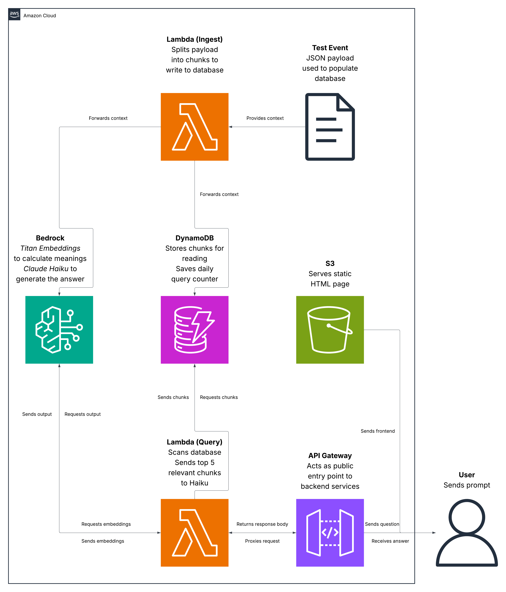

# AWS RAG Chatbot

A fully serverless retrieval-augmented generation (RAG) chatbot built on AWS that answers questions about any of my AWS portfolio projects. README content is chunked, embedded, and stored in DynamoDB, then retrieved by semantic similarity at query time and passed to Claude Haiku to generate an output. Built to gain hands-on experience with Amazon Bedrock, vector embeddings, and retrieval pipelines. 

## Live Demo

[http://rag-chatbot-frontend-nevenspooner.s3-website-ap-southeast-2.amazonaws.com/](http://rag-chatbot-frontend-nevenspooner.s3-website-ap-southeast-2.amazonaws.com/)

## Architecture

## AWS Services Used

- Amazon Bedrock - Titan Embeddings for vectorisation, Claude Haiku for answer generation
- Amazon DynamoDB - Stores text chunks and their embedding vectors
- AWS Lambda - Ingestion and query logic (Python)
- Amazon API Gateway - Public-facing HTTP API endpoint with throttling
- Amazon S3 - Static frontend hosting
- AWS IAM - Scoped, resource-specific permissions connecting Lambda to Bedrock and DynamoDB

## Request Flow

### Ingest

1. README text is passed to the ingestion Lambda as a test event with a project name
2. Lambda splits the text into chunks by matching against a fixed list of section headers
3. Each chunk is prefixed with its project and section name, then sent to Titan Embeddings
4. Titan returns a 1024-dimension vector
5. The chunk text, project, section, and vector are written to DynamoDB with a UUID partition key

### Query

1. The frontend sends a POST request to API Gateway
2. API Gateway applies burst rate limits before passing the request to Lambda
3. Lambda rejects empty or oversized questions before any billable call is made
4. A daily query counter is atomically incremented in DynamoDB and checked against a hard limit
5. The question is embedded via Titan Embeddings
6. Lambda scans DynamoDB for all chunks and, if the question names a specific project, filters to that project only
7. Cosine similarity is computed in Lambda between the question vector and every chunk vector
8. The top 5 chunks are passed to Claude Haiku as grounding context
9. Haiku returns an answer, which is rendered as markdown alongside the retrieved source chunks

## Design Decisions

- DynamoDB to store vectors - a full table scan with cosine similarity computed in Lambda is fast, cheap, and removes the need for a dedicated vector database. This is explicitly a scale-dependent decision, not a general one
- Cosine similarity calculated in Lambda - forced a real understanding of what similarity search actually does which provides transparency and can help build trust 
- Project and section names properly embedded - the embedding input is formatted as `Project - Section: text`. This ensures the project's identity influences the results, as opposed to if it were only a metadata column, to generate  accurate outputs 
- Explicit project-name pre-filter - embedding the project name raises its influence but guarantees nothing, since cosine similarity measures the degree of relevancy. When a question names a project, the candidate set is hard-filtered to that project first
- Corpus-level questions bypass similarity search - questions like "list all projects" are not about any one chunk, so top-K retrieval will never return balanced coverage. These are detected and answered from one Overview chunk per project, in a fixed canonical order
- Hard daily query limit in Lambda - API Gateway throttling caps request rate, not spend. A public endpoint calling Bedrock has an unbounded cost ceiling without an application-level counter. This is fixed using an atomic DynamoDB counter
- Claude Haiku over larger models - the generation step is summarising retrieved text, not reasoning from scratch. Haiku is the cheapest model that does this well, and cost per query matters on a public endpoint

## Key Learnings

- Metadata columns do not influence semantic search - each chunk is processed into a list of numbers used to represent its semantic meanings. Semantic similarity is calculated by comparing these lists. The database categorises these chunks using project names and section headers. The issue with this was that the title did not exist within the chunk itself, so asking "what did you learn from the URL Shortener" returned chunks from other projects that happened to be more semantically similar to the question. The fix was to prepend the project and section name to the text before embedding it, so that project identity became part of the meaning rather than a label attached to the outside of it
- Relevance is not the same as correctness - two chunks about API Gateway throttling are genuinely similar whether they came from the Serverless Contact Form or the URL shortener. In cases like this, a hard filter is required, so the query Lambda now restricts the candidate set to a single project before similarity search even runs, unless asked otherwise 
- Top-K retrieval cannot answer questions about the whole corpus - "list all my projects" consistently returned three of four, because the top 5 chunks by similarity were never one Overview from each project; they were two chunks from one project and one each from two others. The model was answering correctly from what it received. Corpus-level questions are now detected and routed around similarity search entirely, receiving one Overview chunk per project in a fixed order

## What I Would Do Next

- Cache answers by question hash - store a hash of the question text as a DynamoDB key alongside its generated answer, and return the cached answer on a hit. A crawler or a bot in a loop asks the same thing repeatedly, so this collapses the cost of the most likely abuse pattern to a single cheap `GetItem` instead of two Bedrock calls, and makes the page noticeably faster for real visitors
- Ingest source code alongside READMEs - the chatbot can describe what each project does and why, but not how any of it is implemented. Ingesting the Lambda functions would let it answer questions like "show me how the conditional write works". Files would need splitting by function rather than being stored whole, since a 400-line file embedded as one chunk produces a vector so diluted it matches nothing well
- Replace substring matching with a real intent classifier -  the project filter is a substring match, which means it only fires if you type the project's full name. Ask "what did the contact form do" and it misses entirely. Real people do not phrase questions the way a keyword list expects, and no amount of adding more keywords will fix that
- Add conversation memory - each question is currently embedded in isolation, so "what about the second one" retrieves nothing useful because the phrase carries no meaning on its own. Memorising prior prompts would make natural back-and-forth conversation possible
- Infrastructure as Code (AWS SAM or CDK) - every resource here was created by hand in the console, which is unreproducible and was the direct cause of two bugs where the deployed Lambda did not match the code it was supposed to be running. Defining the stack as code makes deployment repeatable and version-controlled, and removes the entire class of "the console was never updated" failures

## Contact

Open to internship and graduate opportunities in software engineering and cloud computing.

- Email: nevenspooner03@gmail.com
- LinkedIn: https://www.linkedin.com/in/neven-spooner/
